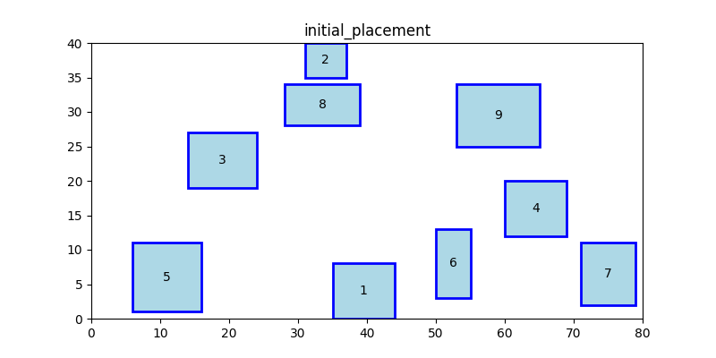

# Rectangle Placement Optimization with Reinforcement Learning

This project demonstrates how to optimize the placement of rectangles within a defined bin area using Python. The placement ensures there is no overlap between rectangles while satisfying specific constraints on their positions. Additionally, the optimized results can be saved to a file for sharing or future use.

## Features

1. **Rectangle Placement**:

   - Randomly initializes placements for rectangles.
   - Ensures no overlap between rectangles.

2. **Graph Constraints**:

   - Uses a graph to model constraints on rectangle proximity.
   - Neighboring rectangles are adjusted to maintain minimum distance constraints.

3. **Optimization**:

   - Simulates a reinforcement learning mechanism to refine the placements.

4. **Save and Load**:

   - Save the optimized placements to a JSON file.
   - Load placements from the saved file for sharing or further use.

5. **Visualization**:
   - Visualize initial and optimized placements using Matplotlib.

## Requirements

The following Python libraries are required:

- `numpy`
- `matplotlib`
- `networkx`
- `scipy`
- `random`
- `json`

Install the libraries using pip:

```bash
pip install numpy matplotlib networkx scipy
```

## Usage

1. **Clone the Repository**:

   ```bash
   git clone https://github.com/aayush598/AutoCuroGNN.git
   cd AutoCuroGNN
   ```

2. **Run the Script**:
   Execute the Python script to visualize initial and optimized placements:

   ```bash
   python main.py
   ```

3. **Save Optimized Placements**:
   The optimized placements are saved to `optimized_placements.json` in the working directory.

## Code Overview

### Key Functions:

- **`is_overlapping`**:
  Checks if two rectangles overlap.

- **`adjust_position`**:
  Adjusts the position of a rectangle to avoid overlap.

- **`initialize_placements`**:
  Randomly initializes non-overlapping placements.

- **`reinforcement_learning`**:
  Refines placements to satisfy graph constraints.

- **`plot_placements`**:
  Visualizes the placements using Matplotlib.

- **`save_placements` and `load_placements`**:
  Save and load rectangle placements to/from a JSON file.

### File Structure:

- `main.py`: Main script with the placement logic.
- `optimized_placements.json`: File to store the optimized placements.

## Visualization Examples

### Initial Placement

The rectangles are placed randomly while avoiding overlaps.



### Optimized Placement

Rectangles are refined to meet constraints and maintain minimum distances.


## Future Improvements

- Add a proper reinforcement learning algorithm for better optimization.
- Introduce more complex constraints for placement.
- Extend the visualization to show optimization steps in real-time.

## License

This project is open-source and available under the [MIT License](LICENSE). Feel free to modify and share!
